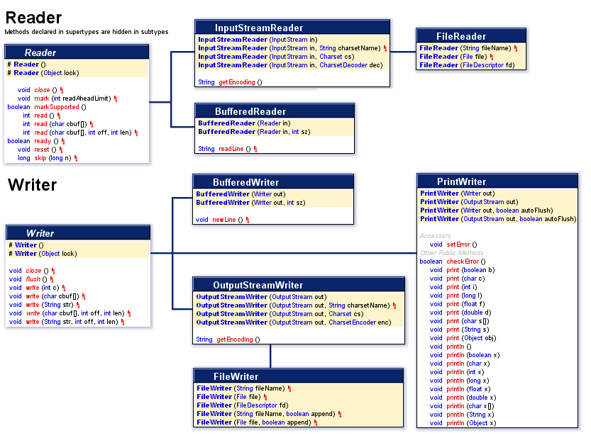

_java.io_ package interacts with files and streams. I/O stream is a sequence of data and is completely different concept than Stream API of Java 8.

**Byte Stream:** 
Classes named with Stream are used for reading/writing all types of binary or byte data, including strings.
Abstract base classes: **InputStream, OutputStream**
Note: OutputStream is capable of writing char or binary data

**Character Stream:** 
Classes named with Reader/Writer are used for input/output of only character and String data. They make writing textual data to file easier and more convenient.
Abstract base classes: **Reader, Writer**

**PrintWriter** and **PrintStream** classes have no corresponding input or reader classes while other classes have always input and output corresponding classes.
**PrintStream** is a child class of **OutputStream**. 

**FileInputStream
FileOutputStream**
They are low-level stream classes (connect directly with data source and process raw data) and read/write by single byte. High-level stream is built on top of another 
stream using Wrapping by which an instance is passed to another class's constructor.  
-1 is returned when reached the end of a file. 

**BufferedInputStream
BufferedOutputStream**
Buffered classes (high-level) read/write data in an array of bytes, rather than a byte by byte. Thus performance is much higher than low-level stream classes.
0 is returned from read() method when reached the end of a file.

**FileReader FileWriter 
BufferedReader BufferedWriter**
Those classes with their buffered classes are most commonly used as they provide a way to directly read/write chars into a file.
-1 is returned when reached the end of a file. _Null_ is returned from readLine() method. 
 

