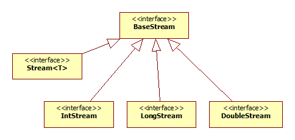

Java 8 has generic **Stream\<T>** and three specific streams for primitives, **DoubleStream**, **IntStream** and **LongStream**

Difference between **Stream\<Integer>** and **IntStream** is that:
**IntStream** is for primitives (int, short, byte and char)
**Stream\<Integer>** is for Integer wrapper class

Methods to convert between different Streams

Source Stream | To Create Stream | To Create DoubleStream | To Create IntStream | To Create LongStream
--- | --- |--- |--- |---
**Stream** | map | mapToDouble | mapToInt | mapToLong
**DoubleStream** | mapToObj | map | mapToInt | mapToLong
**IntStream** | mapToObj | mapToDouble | map | mapToLong
**LongStream** | mapToObj | mapToDouble | mapToInt | map
 
Those **map*** methods take Function parameter, respectively. 

Source Stream | To Create Stream | To Create DoubleStream | To Create IntStream | To Create LongStream
--- | --- |--- |--- |---
**Stream** | Function | ToDoubleFunction | ToIntFunction | ToLongFunction
**DoubleStream** | DoubleFunction | DoubleUnaryOperator | DoubleToIntFunction | DoubleToLongFunction
**IntStream** | IntFunction | IntToDoubleFunction | IntUnaryOperator | IntToLongFunction
**LongStream** | LongFunction | LongToDoubleFunction | LongToIntFunction | LongUnaryOperator
